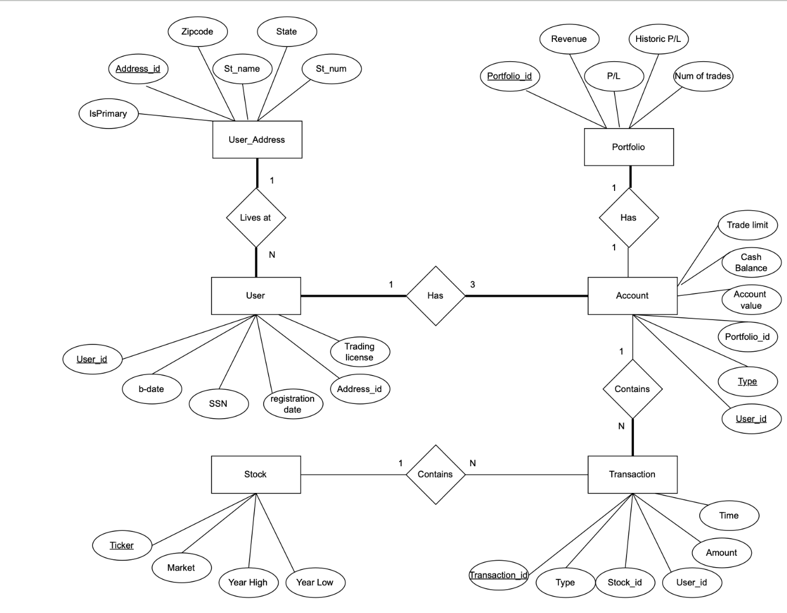
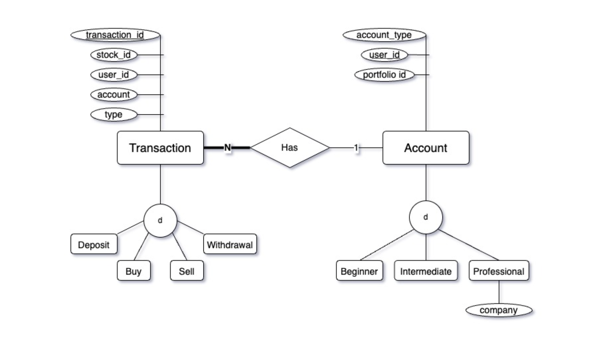
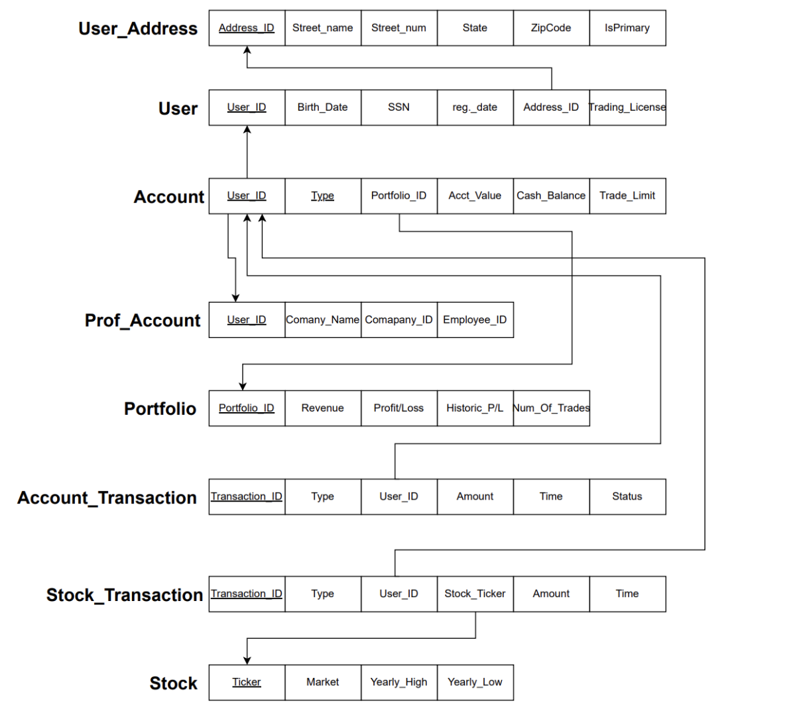

# Stock Trading Platform Relational Database

## Project Overview

This project models a stock trading platform's database, similar to those used by firms like Interactive Brokers or Robinhood. It's designed to handle the complex relationships between users, accounts, transactions, and stocks, reflecting the real-world operations of a stock brokerage.

## Goals and Learning Outcomes

The goal of this project was to create a robust database schema capable of managing the diverse needs of a stock trading platform, from handling user information and accounts to processing transactions. Key learning outcomes include:

* Mastery of complex SQL queries and database optimization
* Understanding of relational database design principles
* Experience in data integrity and security measures

## Database Schema Overview

The database schema for the Stock Brokerage App is a comprehensive representation of a brokerage's operational structure, encapsulating the intricacies of client management, transaction processing, and asset tracking. It's engineered to mimic characteristic of stock trading platforms, ensuring data integrity and efficient query processing.

Key tables within the schema are interconnected through primary and foreign keys, facilitating a relational model that closely mimics the complex interdependencies of the trading ecosystem. The Account table embodies the diversity of client portfolios, with provisions to distinguish between different account types, reflecting varied trading strategies and risk profiles. This differentiation is key for tailoring user experiences and enabling targeted financial services.

## ER/EER Diagrams and Logic Design

Below are the Entity-Relationship (ER), Enhanced Entity-Relationship (EER), and Logic Design diagrams that provide a visual representation of the database schema:

### ER Diagram



### ER Diagram




### Logic Design




## Usage Examples

```sql
-- Insert a new user address
INSERT INTO `user_address` VALUES (3, 'Elm Street', 100, 'NY', 10001, 1);

-- Add a new user
INSERT INTO `user` VALUES (3, 'Ada', 'Lovelace', '1815-12-10', 333445555, '2023-04-01', 3, 7);

-- Record a new account transaction
INSERT INTO `account_transaction` VALUES (3, 'deposit', 3, 5000, '2023-04-01', 'pending');
